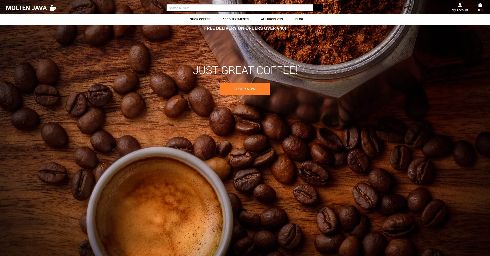
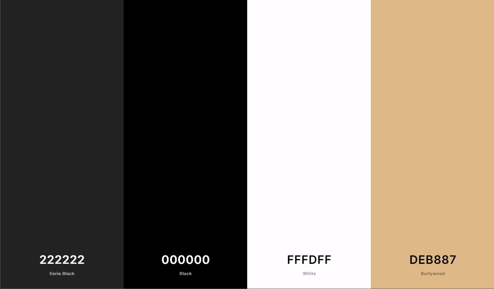

# Molten Java

[View the Live website here](https://jay359-molten-java.herokuapp.com/)

### Molten Java is the ficticious business website of Molten Java.

Molten java is a fictitious coffee shop and coffee roasters business in cork city.
This website serves as en e-commerce platform for the business, as well as being a social point of contact with existing and potential customers.

## UX

### This website is for:

* Visitors to the website are ideally coming to purchase coffee and coffee accessories from the business, but the interesting blog posts and opportunity to sign up for update emails may also make it a more informational social resource also.

### User Stories

* As a visitor to this website, I would like the navagation to be instantly understandable.
* As a visitor I would like an inventory of stock to browse through.
* As a visitor I would like the ability to search for products by name.
* As a visitor I would like the ability to register for an account for secure purchasing.
* As a visitor I would like an email sign up option, to be kept up to date with site news.
* As a visitor I would like the option to follow the site on social media platforms.
* As a visitor I would like the ability to comment on the blog posts I have read.

* As a menber of the website, I would like to 'Login' to my profile and view past purchases.
* As a member of the website, I would the ability to manage and update my shipping and payment details.
* As a member of the website, I would like to be able to read reviews and review products myself.

* As an Admin of the website, I would like all of the above capabilities, but also the ability to add categories of products and the products themselves to the website, including price ratings and images, and the ability to delete reviews and blog comments which may be inappropriate or not in keeping with the sites ethos.

## Design

* Colors - The entire site is rendered in contemporary tones of black, charcoal, gold and white, This was a considered design choice to reflect the tones of other contemporary coffee brands, which suit the product quite well.

* Font - The font I have used for the site is [Roboto](http://fonts.google.com/specimen/Roboto), this font covers all text elements, I selected this font because of its versatility, in that it is modern, but also clear and bold in its various weights.

* Icons - The Icons used in this project are taken from [Font Awesome](https://fontawesome.com/), which hosts a diverse set of options.

### Wireframes

* [Homepage](wireframes/homepage.pdf)
* [Products page](wireframes/products.pdf)
* [Single product page](wireframes/single-product.pdf)
* [Blog Homepage](wireframes/blog-home.pdf)
* [Blog article view](wireframes/blog-article.pdf)

## Features

* The navagation and footer with sign up extend across all pages.

### Home page 

* The Home page features a full screen 'hero image' which makes it very clear what the focus of the site will be.
* Overlaying the image is a welcome slogan plus a button, which lets the visitor go straight to the coffee page.
* A centered card features an image of a new coffee product with a link to go to that products page.

### Shop Coffee - Pages 
* This tab has several coffee product categories, once selected the user is brought to a gallery type page where products can be viewed and clicked on to view more information about them.

### Accoutrements - Pages 
* This tab also has several product categories for brewing products and molten java merchandise. As before once selected the user is brought to gallery pages where the products can be viewed in detail.

### All Products 
* This tab is a way of viewing all the products together, organised by different criteria, price, name etc.

### Product Reviews
* On accessing an individual product details, a user has the opportunity to leave a star rating and a review of that product. The user needs to be registered and logged in to access this facility.

### Blog - Page
* This tab brings you directly to the blog page, where blog posts can be seen in chronological order.
* On accessing the individual blog posts a user is also give the opportunity to comment on that post. the user does not need to be logged in to do this.

### My Account 
* This clickable link will bring the user , to the login, logout and register options, if the user has admin privileges there will also be a product managment link.

### Page Footer
* This area consists of an email sign up form and social media links.
* On entering an email address and submitting it, an email is sent to a gmail address I have setup (moltenjava21@gmail.com), requesting to join the mailing list.
* Several clickable icons for social media sites will take you to those sites.

### Admin CRUD functionality

* An Admin user has full control of all content on the site, such as:
* adding and editing/deleting new products and categories of products.
* adding and editing/deleting blog posts.
* adding and editing/deleting blog post comments.
* adding and editing/deleting product reviews.
* The ability to delete users profiles completly.

## Features left to add
* In the coffee products page a dropdown option is there for three different size of bags, and although the size is stored in the checkout, the price for each size is the same, which would obviously not be ideal in a real world situation, so in the future a product/size/price model could be made to fix this. I unfortunately didn't have the time to figure it out.
* I was also going to add the option for the customer to choose the type of grind for their selected coffee beans, this I also didn't have time to implement, and removed the option from the finished website, but the option still exists in the 'django admin' page.

## Technologies Used

### Languages uses

* [HTML5](https://en.wikipedia.org/wiki/HTML5)
* [CSS3](https://en.wikipedia.org/wiki/CSS)
* [JavaScript](https://en.wikipedia.org/wiki/JavaScript)
* [Python](https://www.python.org/)
* [Jquery](https://jquery.com/)

### Frameworks, libraries etc.

* [Gitpod](https://gitpod.io/) - Developer environment was used to write the code.
* [Github](https://github.com/) - Used to host the project.
* [Heroku](https://heroku.com/) - Used to deploy the finished project.
* [Bootstrap](https://getbootstrap.com/) - Used for responsive grid system, utilizing components for navagation, cards and forms etc.
* [Django](https://www.djangoproject.com/) - Used as the backbone of the project with front and backend utilities.
* [Stripe](https://stripe.com/) - Used for handling the payments on the site.
* [Amazon Web Servies](http://aws.amazon.com/) - Cloud platform for hosting static and media files.
* [emailJs](https://www.emailjs.com/) - Used to foward email from email sign up in footer.
* [Google Fonts](https://fonts.google.com/) - Used for the websites various fonts.
* [Font Awsome](https://fontawesome.com/) - The Font Awesome library was used for the icons the website.
* [favicon.io](favicon.io) - Was used to create the favicon for the browser tab.
* [TinyJPG](https://tinyjpg.com/) - Used to compress the websites images.
* [Balsamiq](https://balsamiq.com/) - Used to create wireframes.

### Database
* All products, categories, blog posts were added to the site using the Django admin 

## Deployment

## Testing
* Details can be found in a separate [Testing](testing.md) page.

## Credits

* [W3Schools](https://www.w3schools.com/) and [Stack Overflow](https://stackoverflow.com/) for all kinds of help during the project.
* Youtube channel[Coding wit stein](https://www.youtube.com/c/CodeWithStein/) For help with the models for product reviews and blog comments

### Images

* Images were taken from [unsplash](https://unsplash.com/).
  - Home page cover image which extends across the website by 🇸🇮 Janko Ferlič on unsplash.
  - Image in about section of homepage by rawkkim on unsplash
* Product images were taken from their various companies websites.

## This website is for educational purposes only.
=======
